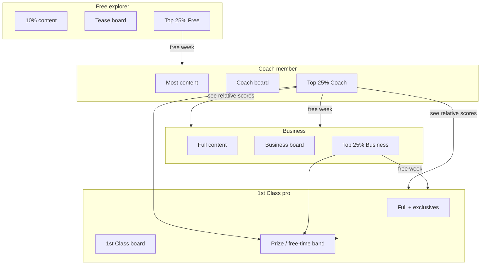
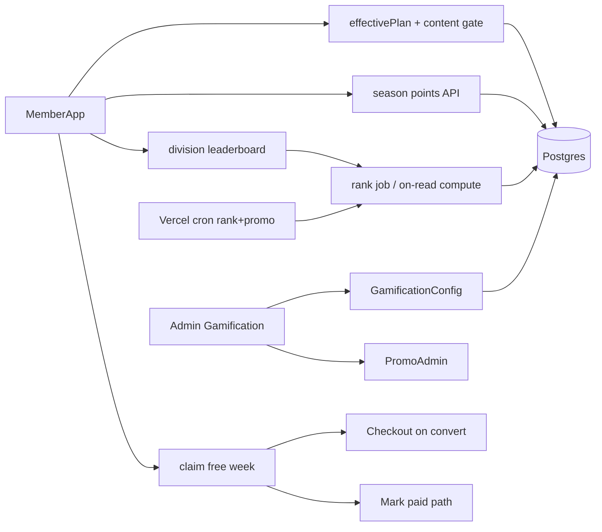

# Gamification design — The Train Station

| Field | Value |
|-------|--------|
| **Status** | In build (v1 ledger + divisions + promos + admin shipped locally) |
| **Date** | 2026-07-22 |
| **Product** | The Train Station |
| **Author** | John + agents |
| **Parking lot** | Stripe Live cutover (Exit sandbox → Vercel `sk_live_` …) — resume after this design |

---

## Overview

Gamification is the **engagement + monetization loop** around coaching content—not a side minigame. Membership tickets (Free / Coach / Business / 1st Class) define how much content you unlock, which **scoreboard division** you compete in, and which **upgrade hooks** fire when you climb into the top of your division.

**First principle (Donkey Kong):**  
The surface story is fitness progress. The business purpose is: **make a short session feel like real progress so the member puts another quarter in**—another login, another week, another upgrade. Casual time still gets somewhere; invested time has a high ceiling (competitive ladder, prizes, free membership time). Free tier is free play on the cabinet: enough to hook, not enough to finish the board.

---

## Background & motivation

### Current state
- Plans already exist: `explorer` | `member` (Coach Class) | `business` | `pro` (1st Class) — `src/lib/signup-plans.ts`
- Points events + leaderboard types: `src/lib/gamification-types.ts`
- Arcade-styled board UI: `src/components/MemberLeaderboard.tsx`
- Point values editable in coach settings; **storage is still JSON/Blob** (`member-gamification-store.ts`) — violates durable-data rule for multi-user prod
- No tiered content % gates, no division ladder, no top-25% peeks, no free-week promo engine, no dedicated admin console

### Pain
- Free members either see too much (no urgency) or too little structure (no “next quarter” moment)
- Paid members lack a competitive social layer that **pulls** upgrades
- Jeremy cannot tune economy without code deploys

---

## Goals & non-goals

### Goals
1. **Content by ticket:** Free ≈ **10%** on-demand; Coach ≈ **most**; Business / 1st Class full + status / prizes path
2. **Division scoreboards:** Coach / Business / 1st Class compete primarily in-division; Free has limited / tease board
3. **Top 25% hooks (“sample the high”):**
   - Free top 25% → free week of **Coach**
   - Coach top 25% → can **see scores relative to Business + 1st Class**; offer free week of **Business**
   - Business top 25% → free week of **1st Class**
   - Elite band (top 25% across paid competitive tiers, config) → **prizes / free membership time**
4. **Admin → Gamification console** with all levers in **Postgres**
5. Session design that maps Donkey Kong “another quarter” to product CTAs
6. Anti-abuse, seasons, and fair ranking windows

### Non-goals (v1)
- Real-money prize cash-out / gambling mechanics
- Replacing Stripe billing for paid plans (promos **grant access**, then convert)
- Full rebuild of program calendar
- Carrier SMS as score channel (Messages hub only unless Twilio un-parked)

---

## Proposed design

### 1. Divisions & tickets

| Ticket | Plan id | Content access (default levers) | Scoreboard |
|--------|---------|----------------------------------|------------|
| Free | `explorer` | ~**10%** of eligible on-demand units | Free division (tease; small list) |
| Coach Class | `member` | ~**85–90%** (“most”) on-demand | Full **Coach** board |
| Business Class | `business` | **100%** + business content flags | **Business** board |
| 1st Class | `pro` | **100%** + 1st Class exclusives | **1st Class** board |

**Promo access:** a free-week grant temporarily elevates **effective access plan** without changing the paid plan stamp until conversion. Display: “Coach trial · 5 days left.”



### 2. Content gating model (coach-operable)

**Unit of content:** a `ProgramDayOption` workout (Gym/Home) or catalog workout tagged for on-demand.

**Mechanism — dual flag (recommended):**

1. **`contentTierMin`** on program day option / workout / cycle day slot:  
   `explorer | member | business | pro` — minimum plan to unlock  
2. **`freePool` boolean** — counted toward Free’s 10% budget when true  

**Budget algorithm (Free):**
- Among all program days in the member’s active program that have `freePool=true` (or auto-tagged first N of cycle), Free may open **`freeContentPercent`** (default 10) of total **scheduled on-demand units** in the current 28-day window  
- Units beyond the pool show **locked cards** with scoreboard tease + upgrade CTA (“Insert coin → Coach Class”)  
- Coach can pin free samples (day 1 Gym, intro mobility) so the 10% is **curated**, not random

**Coach “most”:** default `coachContentPercent` = 90 — remaining 10% reserved for Business/1st exclusives (`contentTierMin >= business`).

Admin tooling: bulk “Mark free sample” / “Business exclusive” on calendar days; progress bar “Free pool used 3/12 days.”

### 3. Scoring economy

**Migrate** gamification ledger from Blob JSON → **Postgres** (`GamificationEvent` rows). Keep event **dedupe id** semantics.

**Event families (expand beyond today’s 5):**

| Family | Examples | Session role |
|--------|----------|--------------|
| **On-ramp** | onboarding, intake book/complete | First quarters |
| **Daily play** | workout_logged, set checkoffs, warm-up before live | Core loop |
| **Streaks** | 3-day / 7-day login or log streak | Return quarter |
| **Live floor** | join live, complete live sets | Peak moments |
| **Social** | community post, coach shout-out (capped) | Soft status |
| **Promo** | claim free week, convert trial | Monetization |

**Donkey Kong session targets:**

| Session | Time | Feel | Points band (tunable) | CTA |
|---------|------|------|------------------------|-----|
| Quick win | &lt;5 min | “I scored” | warm-up or 1 set log | Come back tomorrow |
| Medium | 15–25 min | Clear level | full workout log + streak tick | See board rank |
| Deep | 45+ min | Boss clear | workout + live + bonus | Top 25% / upgrade tease |

**Soft caps:** daily point ceiling (e.g. 150) so grinding doesn’t break the board; diminishing returns after N workout_logs/day.

### 4. Ranking windows & top 25%

**Season** (default lever): rolling **28 days** of **seasonPoints** (subset of events), not all-time lifetime (lifetime still shown as vanity).

**Qualification:**
- Min **active days** in window (default 4) to enter top-25% eligibility  
- Min **seasonPoints** floor (default 100)  
- Ties: higher seasonPoints → more recent lastEventAt → lower userId  

**Top 25%:** `rank <= ceil(0.25 * eligibleCount)` with **min cohort size** (e.g. need ≥8 eligible or fall back to top 2) so tiny boards don’t all “win.”

**Cross-division visibility (Coach top 25%):**
- UI section: “How you stack vs Business / 1st Class”  
- Show **anonymized or first-name** ranks and points of Business + 1st Class **same season** (not full roster unless elite)  
- Free never sees full paid boards—only “#12 Free · top 25% → free Coach week”

### 5. Free-week promotions (“drug dealer” sample)

**Flow:**
1. Nightly (or on rank refresh) job computes division percentiles  
2. If member newly enters top 25% and no open promo: create `GamificationPromo`  
   - `fromPlan`, `toPlan`, `startsAt` null until claim, `expiresAt` claim-by window (e.g. 72h to claim)  
3. In-app banner + message: “You’re crushing Free. **1 free week of Coach** — claim?”  
4. On claim: set `accessPlanOverride = toPlan` until `trialEndsAt`; content + board use **effective plan**  
5. At trial end: toast → checkout for `toPlan`; if no pay, revert override; optional grace 24h  

**Abuse prevention:**
- Max 1 free-week **per from→to edge** per 90 days  
- No stacking trials  
- Coach can revoke  
- Venmo/Stripe: trial is **access only**; Mark paid / Checkout still required to keep tier  

### 6. Elite / prizes

When member is in **top 25% of their paid division** *and* global competitive band (config: union of top 25% Coach+Business+1st by seasonPoints):
- Eligible for **prize pool** / **free membership days**  
- Admin awards manually or auto-rules (e.g. season #1 Coach → 7 free days Business)  
- Ledger: `PrizeAward` with public “Hall of Fame” optional  

### 7. Admin → Gamification console

**Route:** `/admin/gamification` (staff), nav entry near Members / Billing.

**Tabs:**

| Tab | Purpose |
|-----|---------|
| **Overview** | Active members by division, season leader, promo funnel (offered / claimed / converted) |
| **Levers** | All config knobs (below) — save → Postgres `GamificationConfig` |
| **Divisions** | Preview boards, force recompute |
| **Promos** | List free-week offers, revoke, manual grant |
| **Prizes** | Award free days / merch notes |
| **Content pool** | Free % usage per program; pin free samples |
| **Integrity** | Flag impossible scores, reset user season, audit log |

### 8. Levers catalog

#### A. John’s stated levers
| Lever | Default | Notes |
|-------|---------|--------|
| `freeContentPercent` | 10 | Free on-demand share |
| `coachContentPercent` | 90 | “Most” for Coach |
| `topPercentile` | 25 | Eligibility cut |
| `freeWeekDays` | 7 | Trial length |
| `claimWindowHours` | 72 | Time to claim promo |
| `seasonDays` | 28 | Ranking window |
| `crossDivisionPeek` | true | Coach top 25% sees up |
| `prizeBandEnabled` | true | Elite prizes |
| Point values per event | existing | Already in coach settings |

#### B. Predicted levers (real arcade economy)
| Lever | Why |
|-------|-----|
| `minActiveDaysForPercentile` | Stop lurkers winning free weeks |
| `minSeasonPointsForPercentile` | Same |
| `minDivisionSizeForTopCut` | Small cohort fairness |
| `dailyPointCap` | Anti-grind / bot |
| `workoutLogPoints` / caps per day | Core economy |
| `streakBonusDays` + multipliers | Return quarter |
| `newMemberBoostDays` + `boostMultiplier` | On-ramp fairness |
| `seasonResetMode` | rolling \| calendar monthly |
| `fomoClaimCopy` / urgency banner | Conversion |
| `promoCooldownCooldown` | free_week \| percent_off_first_month |
| `cooldownDaysPerEdge` | Abuse (90) |
| `showExactRanksAbove` | Competitive intensity |
| `anonymizeRivals` | Privacy |
| `liveClassPointBonus` | Push live attendance |
| `weekendEventMultiplier` | Coach “double score Saturday” |
| `referralBonusPoints` (capped) | Growth |
| `decayInactiveDays` | Board freshness |
| `lockedContentTeaserMode` | blur \| sample_video \| coach_clip |
| `upgradeCtaIntensity` | soft \| medium \| hard sell |
| `elitePrizeAutoRules` JSON | Season automation |
| `featureFlagGamificationV2` | Rollout |

### 9. Architecture



**Effective plan resolution:**
```ts
effectivePlan(profile) =
  activePromo?.accessPlanOverride
  ?? profile.plan
```

Gates for Today / workouts / videos use `effectivePlan`, not raw ticket alone.

### 10. Data model (Postgres)

```prisma
model GamificationConfig {
  id        String   @id @default("default")
  // JSON blob of levers + version
  levers    Json
  updatedAt DateTime @updatedAt
  updatedBy String?
}

model GamificationEvent {
  id        String   @id // dedupe key
  userId    String
  type      String
  points    Int
  label     String
  at        DateTime
  programSlug String?
  seasonKey String?  // e.g. 2026-W30 or rolling bucket
  meta      Json?
  @@index([userId, at])
  @@index([seasonKey, userId])
  @@index([type, at])
}

model GamificationSeasonScore {
  userId     String
  seasonKey  String
  division   String  // explorer|member|business|pro
  points     Int
  activeDays Int
  lastEventAt DateTime
  rank       Int?
  percentile Float?
  updatedAt  DateTime @updatedAt
  @@id([userId, seasonKey])
  @@index([seasonKey, division, points])
}

model GamificationPromo {
  id           String   @id @default(cuid())
  userId       String
  kind         String   // free_week_upgrade
  fromPlan     String
  toPlan       String
  status       String   // offered|claimed|expired|converted|revoked
  offeredAt    DateTime
  claimBy      DateTime?
  claimedAt    DateTime?
  trialEndsAt  DateTime?
  convertedAt  DateTime?
  @@index([userId, status])
  @@index([status, claimBy])
}

model GamificationPrizeAward {
  id        String   @id @default(cuid())
  userId    String
  seasonKey String
  label     String
  freeDays  Int?
  notes     String?
  awardedAt DateTime @default(now())
  awardedBy String?
}

// On ProgramDayOption or Workout:
// contentTierMin String @default("explorer")
// freePool Boolean @default(false)
```

**Migration:** import Blob `member-gamification.json` → `GamificationEvent` once; dual-read during cutover.

### 11. API sketch

| Method | Path | Role |
|--------|------|------|
| GET | `/api/member/gamification/me` | Season score, rank, percentile, locks summary |
| GET | `/api/member/gamification/leaderboard?division=` | Division board + optional peek |
| POST | `/api/member/gamification/promos/:id/claim` | Claim free week |
| GET | `/api/admin/gamification/config` | Levers |
| PATCH | `/api/admin/gamification/config` | Update levers |
| GET | `/api/admin/gamification/promos` | Admin list |
| POST | `/api/admin/gamification/promos` | Manual grant |
| POST | `/api/admin/gamification/recompute` | Force season ranks |
| Cron | `/api/cron/gamification-season` | Recompute + offer promos |

### 12. Member UX beats (quarters)

1. **Login** — “+streak · 2 days” chip  
2. **Today locked free day** — 10% meter + “Top Free #4 · claim Coach week” if eligible  
3. **Log workout** — arcade points toast + rank delta (“↑3 to top 25%”)  
4. **Rest timer end** — already SFX; optional micro-points later  
5. **Board** — division tab; Coach top 25% unlocks “Upstairs” peek  
6. **Claim trial** — confetti + content unlock  
7. **Trial day −1** — hard CTA checkout  

---

## Alternatives considered

| Option | Pros | Cons | Verdict |
|--------|------|------|---------|
| **A. Config + division seasons (this design)** | Tunable, fair windows, clear promos | More schema | **Chosen** |
| **B. Lifetime points only** | Simple | Old whales dominate; weak free-week fairness | Reject |
| **C. Hard-code 10% first 3 days only** | Easy | No coach control; not “content %” | Reject as sole model |
| **D. Separate mobile game app** | Novel | Split attention from coaching | Non-goal |

---

## Security & privacy

- Leaderboards: staff can force display names; option to hide last name  
- Promos: staff-only grant/revoke; rate-limit claim  
- No client-trusted points—all awards server-side with dedupe ids  
- Cron secret for recompute  
- Free-week must not skip **payment** permanently without Mark paid / Stripe  

---

## Observability

- Metrics: `gamification.events`, `promo.offered|claimed|converted`, `board.recompute_ms`  
- Funnel dashboard in Admin Overview  
- Alert if convert rate &lt; X% or promo abuse spike  

---

## Rollout plan

1. **Flag** `GAMIFICATION_V2=true` on Preview  
2. Migrate events to Postgres (dual-read)  
3. Config + admin levers (no behavior change)  
4. Division boards + season scores  
5. Content gates (start Free 10% on one program)  
6. Free-week promos (Free→Coach only first)  
7. Cross-division peek + Business/1st promos  
8. Prizes  
9. Prod flag on; monitor  

**Rollback:** flag off → old leaderboard + no gates; promos expire safely.

---

## Key decisions

1. **Gamification is the product loop name** — not a separate game brand; UI can still say “High scores / Arcade.”  
2. **Season (28d) ranks for top 25%**, lifetime for vanity.  
3. **Content % is coach-curated free pool + tier minimums**, not pure random.  
4. **Effective plan override** for free weeks; paid plan unchanged until convert.  
5. **Postgres is source of truth** for events, seasons, promos, config (Blob is migration only).  
6. **Dedicated Admin → Gamification** so Jeremy can turn levers without deploys.  
7. **Donkey Kong session ladder** drives point values and CTA placement.  
8. **Drug-dealer upgrades** only after real activity (min days + points), with cooldowns.

---

## Open questions

1. Free board: show only self + top 3, or full Free division?  
2. Free week: auto-enroll on claim into Adult Strength Gym track?  
3. Prize fulfillment: manual Jeremy only for v1, or Stripe coupon auto?  
4. Should Business exclusive content be separate programs or flags on Adult days?  
5. Public Hall of Fame on marketing site?  

---

## PR Plan

| PR | Title | Scope | Depends |
|----|--------|--------|---------|
| **PR1** | Gamification Postgres ledger | `GamificationEvent` migration, import from Blob, dual-read write path | — |
| **PR2** | Config + Admin levers UI | `GamificationConfig`, `/admin/gamification` Levers tab | PR1 |
| **PR3** | Season scores + division boards | Rank job, API, MemberLeaderboard division tabs | PR1–2 |
| **PR4** | Content tier + free pool | Schema flags, Today lock UI, admin content pool | PR2 |
| **PR5** | Free→Coach free-week promos | Offer/claim/expire, effective plan | PR3–4 |
| **PR6** | Cross-division peek + Coach→Biz / Biz→1st promos | Peek UI, edges | PR5 |
| **PR7** | Elite prizes + funnel metrics | Prize awards, overview KPIs | PR6 |
| **PR8** | Economy polish | Caps, streaks, weekend multiplier, copy | PR3+ |

Each PR independently reviewable; feature flag wraps member-visible behavior from PR3 onward.

---

## Risks

| Risk | Severity | Mitigation |
|------|----------|------------|
| Free week abuse / multi-accounts | High | Min activity, cooldown, staff revoke, device heuristics later |
| Top 25% with tiny N | Medium | minDivisionSize |
| Content lock frustrates free users | Medium | Curated free pool + clear progress to 10% |
| Points inflation | Medium | Daily caps, season reset |
| Blob dual-write bugs | Medium | Import once, cut over, soak script |
| Promo without Stripe Live | Low | Access-only trial; Venmo Mark paid still works |

---

## References

- `src/lib/gamification-types.ts`, `member-gamification-store.ts`, `member-gamification-progress.ts`
- `src/components/MemberLeaderboard.tsx`
- `src/lib/signup-plans.ts`, `member-gates.ts`
- `CONTEXT.md` — payments / durable storage rules
- Stripe Live cutover — parked (sandbox Exit → Vercel live keys)

---

## Stripe bookmark (do not lose)

**Where we left off:** Prod still `stripeTestMode: true`. User was in **Train Station sandbox**; next step is **Exit sandbox** → Live keys into Vercel Production (`STRIPE_SECRET_KEY=sk_live_…`, prices, webhook) → redeploy → verify `/api/payments/public`.
