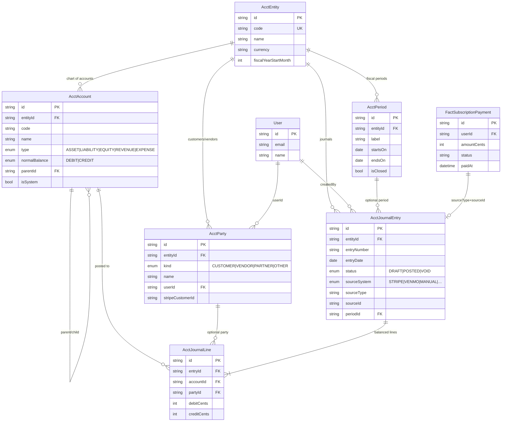

# Train Station Accounting Books — ER diagram

QuickBooks-style **double-entry** framework (own general ledger).  
Complements (does not replace) `FactSubscriptionPayment` cash events and Stripe Admin Billing.

## Entity relationship diagram



## How money flows into the books

```
Member pays (Stripe checkout / Venmo Mark paid)
        │
        ▼
FactSubscriptionPayment  (cash event / books list)
        │
        ▼  postMembershipCashReceipt()  [idempotent]
AcctJournalEntry  POSTED
   ├─ Dr 1000 Cash — Stripe  (or 1010 Venmo)
   └─ Cr 4000 Membership revenue  (or 4010 Tips)
        │
        ▼
AcctParty (CUSTOMER) linked to User when known
```

## System chart (seed)

| Code | Name | Type |
|------|------|------|
| 1000 | Cash — Stripe clearing | ASSET |
| 1010 | Cash — Venmo / undeposited | ASSET |
| 1100 | Accounts receivable | ASSET |
| 2000 | Deferred membership revenue | LIABILITY |
| 2100 | Partner fee pool payable | LIABILITY |
| 3000 | Owner equity | EQUITY |
| 3100 | Retained earnings | EQUITY |
| 4000 | Membership revenue | REVENUE |
| 4010 | Tips revenue | REVENUE |
| 4020 | Merchandise / other revenue | REVENUE |
| 5000 | Stripe processing fees | EXPENSE |
| 5100 | Platform / partnership fees | EXPENSE |
| 5200 | Refunds & chargebacks | EXPENSE |
| 6000 | Operating expenses | EXPENSE |

## Double-entry rule

For every **POSTED** journal:

\[
\sum \text{debitCents} = \sum \text{creditCents}
\]

Idempotency: unique `(sourceSystem, sourceType, sourceId)`  
e.g. `STRIPE` + `FactSubscriptionPayment` + fact row id.

## Product direction

- **Source of truth** is this Postgres GL + payment facts — not QuickBooks export.
- **For now Stripe is the bank:** card money settles into the merchant Stripe balance. In the chart that is **1000 Cash — Stripe clearing**. Live balances / charges still show on Admin → **Stripe money**; Books records the same story as double-entry.
- **Venmo / cash** use **1010** (undeposited) until we treat them as banked.
- **Later:** native bank feed / recon can still attach to these accounts — no file export path.
- TS **Books** is the permanent ledger; Stripe is the cash rail + processor UI.

## Ops

```bash
# Apply migration (prod)
npx prisma migrate deploy

# Seed chart + entity
node scripts/seed-accounting-books-prod.mjs

# Also post existing FactSubscriptionPayment rows into the GL
BACKFILL=1 node scripts/seed-accounting-books-prod.mjs
```
