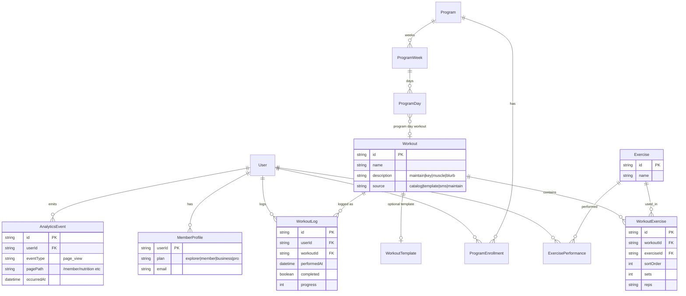

# Quick maintain — entity model & access

Business+ unlimited muscle-group sessions; Coach Class greyscale teaser with earn path (2 show-ups + on-demand → 5 uses / calendar month).

## ER diagram (maintain slice)

## Access rules (not separate tables)

| Plan | Mode | Rule |
|------|------|------|
| **business**, **pro** | `full` | Unlimited start/log of `Workout.source = maintain` |
| **member** (Coach Class) | `earned` | Calendar month: ≥2 **completed** logs where workout.source ≠ `maintain`, **and** on-demand page_views done → up to **5** maintain logs that month |
| **member** (not earned / uses exhausted) | `locked` | UI greyscale; upgrade CTA to Business |
| **explorer** | `locked` | Teaser / upgrade path |
| **Any plan** | `dayComplete` | If any **completed** `WorkoutLog` today (app TZ) → **blocked** + green angled **Day Complete** stamp |

**Uses** = count of `WorkoutLog` rows this month joined to `Workout.source = 'maintain'`.  
**Show-ups** = count of completed non-maintain logs this month.  
**On-demand** = `AnalyticsEvent` page_views for published nutrition / coach media paths this month.  
**Day complete** overrides full/earned — no second train via maintain the same day.

No new Prisma models — reuses `Workout`, `WorkoutLog`, `AnalyticsEvent`, `MemberProfile.plan`.

## Seeded library

Idempotent seed creates five `Workout` rows with `source = "maintain"` when missing:

1. Upper Push  
2. Upper Pull  
3. Lower Body  
4. Full Body  
5. Core + Engine  

Meta encoded in `description`: `maintain|{key}|{muscleGroup}|{blurb}`.

## App surfaces

| Surface | Behavior |
|---------|----------|
| Today · day summary row | Side card (grey when locked) |
| `#quick-maintain` | Full list + unlock checklist |
| Hub 4th tile | Maintain · locked / uses left / unlimited |
| `POST /api/workouts/[id]/log` | `resolveMaintainAccess` gate |

## Related code

- `src/lib/member-maintain-workouts.ts` — seed, list, access  
- `src/components/MemberMaintainWorkouts.tsx`  
- `src/components/MemberTodayShell.tsx` / `MemberTodayHub.tsx`  
- `src/app/member/today/page.tsx`  
- `src/app/api/workouts/[id]/log/route.ts`  
