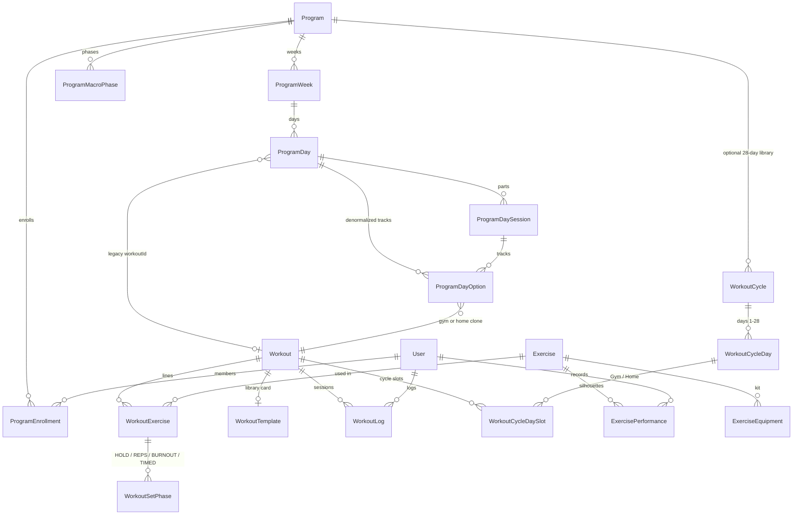

# Programs, workouts, and exercises

Printable ER: [`programs-workouts-exercises-er.pdf`](./programs-workouts-exercises-er.pdf)

Regenerate after a schema change:

```bash
python3 docs/generate-programs-workouts-er.py
```

Source of truth: `prisma/schema.prisma`.


