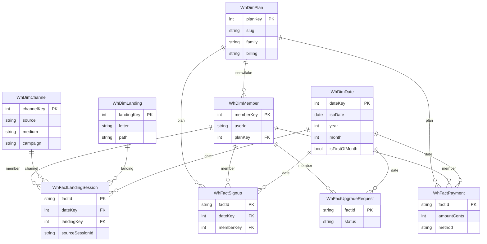

# Analytics warehouse — star / snowflake (21 Sep 2026)

OLAP copy. **OLTP Prisma tables stay source of truth.** Checkout never writes here. Nightly `mart-rollup` (and first load) upserts facts.

Pacific calendar (`America/Los_Angeles`) on `WhDimDate.dateKey` = `YYYYMMDD`.

| Grain | Table | Source |
|-------|--------|--------|
| One guest/member visit | `WhFactLandingSession` | `AnalyticsSession` |
| One account created | `WhFactSignup` | `User` |
| One cash event | `WhFactPayment` | `FactSubscriptionPayment` |
| One Coach→Business request | `WhFactUpgradeRequest` | `MemberProfile.businessUpgrade*` |

Landing keys: **1 A `/a`**, **2 B `/b`**, **3 C `/l/floor`**, **4 D `/l/class`**, **0 other**.

Snowflake: member → plan (family / billing). Channel is a junk-dimension (source × medium × campaign).
